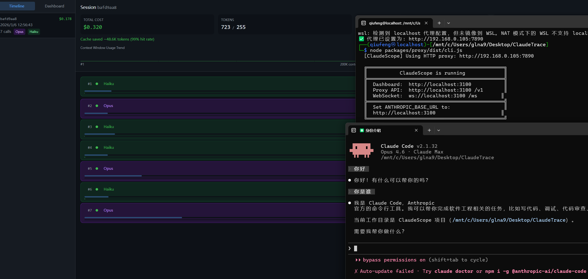

<p align="center">
  <h1 align="center">ClaudeScope</h1>
  <p align="center"><strong>DevTools for Claude API & Claude Code</strong></p>
</p>

<p align="center">
  
  
  
  
</p>

<p align="center">
  <a href="#quick-start">Quick Start</a> &bull;
  <a href="#features">Features</a> &bull;
  <a href="#claude-code-integration">Claude Code</a> &bull;
  <a href="#proxy-configuration">Proxy</a> &bull;
  <a href="#export--share">Export</a> &bull;
  <a href="#api-reference">API</a> &bull;
  <a href="#contributing">Contributing</a>
</p>

> **English** | [中文](#中文文档)

---

A local-first observability tool for Claude API and Claude Code. ClaudeScope acts as a transparent proxy between your application and the Anthropic API, capturing every request and response in real time. All data is stored locally — no cloud dependencies, no telemetry.

<p align="center">
  
  <br/>
  <sub>Real-time dashboard showing API calls, token usage, cost breakdown, and tool call timeline</sub>
</p>

---

## The Problem

When building with Claude agents, developers face three challenges:

- **No visibility** — Agents execute autonomously, making tool calls and decisions with no way to inspect the intermediate steps. Debugging requires ad-hoc logging.
- **Opaque costs** — Token-based pricing makes it difficult to attribute costs to specific operations, prompts, or sessions.
- **No history** — Agent behavior is non-deterministic. Without persistent records, reproducing and comparing past runs is impossible.

ClaudeScope provides full observability with a single configuration change.

---

## Quick Start

### One-command install (recommended)

```bash
npx @q1uf3ng/claude-scope
```

That's it. Open `http://localhost:3100` to view the dashboard.

### Option 1: Proxy Mode (zero code change)

Set the environment variable and use Claude Code as usual:

```bash
export ANTHROPIC_BASE_URL=http://localhost:3100
```

Then point your Anthropic SDK to the local proxy:

```typescript
const client = new Anthropic({
  baseURL: 'http://localhost:3100',
})
```

```python
client = anthropic.Anthropic(
    base_url="http://localhost:3100",
)
```

Open `http://localhost:3100` to view the dashboard.

### Option 2: SDK Wrapper (one line of code)

```typescript
import { trace } from '@claude-scope/sdk'
import Anthropic from '@anthropic-ai/sdk'

const client = trace(new Anthropic())
```

### Option 3: Claude Code Integration

```bash
# Terminal 1: Start ClaudeScope
node packages/proxy/dist/cli.js

# Terminal 2: Run Claude Code through the proxy
ANTHROPIC_BASE_URL=http://localhost:3100 claude
```

Works with `--dangerously-skip-permissions`:

```bash
ANTHROPIC_BASE_URL=http://localhost:3100 claude --dangerously-skip-permissions
```

**Shell aliases** — add to `~/.bashrc` or `~/.zshrc`:

```bash
alias claude-scope='node /path/to/claude-scope/packages/proxy/dist/cli.js'
alias claude-scoped='ANTHROPIC_BASE_URL=http://localhost:3100 claude'
alias claude-auto='ANTHROPIC_BASE_URL=http://localhost:3100 claude --dangerously-skip-permissions'
```

### Install from Source (alternative)

```bash
git clone https://github.com/q1uf3ng/claude-scope.git
cd claude-scope
pnpm install
pnpm build
node packages/proxy/dist/cli.js
```

---

## Features

### Real-Time Timeline

Every API call rendered as a card with model badge, tool call tags, token counter, per-call cost, latency indicator, and context window usage. Click to expand for full request/response JSON, tool inputs and results, error details, and cache breakdown.

### Live Streaming

WebSocket-driven real-time updates. Cards appear on request start, token counters update during streaming, and finalize on completion. No polling.

### Cost Dashboard

- Daily cost chart
- Model breakdown (Opus / Sonnet / Haiku)
- Top sessions by cost
- Cache savings visualization

### Context Window Visualization

Per-call progress bar (current tokens / 200K max) with color coding: green (< 50%), orange (50–80%), red (> 80%). Session-level trend with stacked input/output breakdown.

### Supported Models & Pricing

| Model | Input | Output | Cache Read | Cache Create |
|-------|-------|--------|------------|--------------|
| Claude Opus 4.6 | $15/M | $75/M | $1.50/M | $18.75/M |
| Claude Sonnet 4.5 | $3/M | $15/M | $0.30/M | $3.75/M |
| Claude Haiku 4.5 | $0.80/M | $4/M | $0.08/M | $1.00/M |
| Claude 3.5 Sonnet | $3/M | $15/M | $0.30/M | $3.75/M |
| Claude 3.5 Haiku | $0.80/M | $4/M | $0.08/M | $1.00/M |

Pricing is configurable via the pricing table in source.

---

## Proxy Mode

The proxy sits between your code and the Anthropic API, transparently recording all traffic.

```
Your Code → localhost:3100 → api.anthropic.com
                ↓
           SQLite DB + WebSocket → Browser Dashboard
```

**Streaming fully supported.** SSE chunks are forwarded in real time while being reassembled for storage.

**Graceful degradation.** If recording fails, requests and responses continue to pass through normally.

### Security

- API keys are **never stored in plaintext** — redacted to `sk-ant***xxxx` before writing to SQLite
- Binds to `localhost` by default — do not expose to public networks
- All data stored locally in `~/.claude-scope/traces.db` — no telemetry, no cloud

### Authentication

ClaudeScope supports both authentication methods:

- **API Key** — `x-api-key` header (standard Anthropic API usage)
- **OAuth / Bearer Token** — `Authorization: Bearer` header (Claude Max subscription via Claude Code)

Both methods are forwarded transparently; ClaudeScope does not modify authentication headers.

---

## Proxy Configuration

ClaudeScope supports HTTP proxy for outbound requests to `api.anthropic.com`. This is useful for environments that require a proxy to reach external services.

### Auto-Detection

By default, ClaudeScope reads proxy settings from standard environment variables:

```bash
# ClaudeScope will auto-detect these
export HTTPS_PROXY=http://your-proxy:port
export HTTP_PROXY=http://your-proxy:port
export ALL_PROXY=http://your-proxy:port

# Bypass proxy for specific hosts
export NO_PROXY=localhost,127.0.0.1,.internal.corp
```

### Manual Configuration

```bash
# Explicitly specify a proxy
claude-scope --proxy http://your-proxy:port

# Explicitly disable proxy (ignore environment variables)
claude-scope --no-proxy
```

### How It Works

When a proxy is configured, ClaudeScope establishes an HTTP CONNECT tunnel to `api.anthropic.com:443` through the proxy, then upgrades the connection to TLS. This preserves end-to-end encryption between ClaudeScope and the Anthropic API.

---

## SDK Mode

For environments where changing `base_url` is not convenient:

```typescript
import { trace } from '@claude-scope/sdk'
import Anthropic from '@anthropic-ai/sdk'

const client = trace(new Anthropic(), {
  endpoint: 'http://localhost:3100',
  sessionId: 'my-experiment-v2',
  debug: true,
})
```

- Intercepts `messages.create()` and `messages.stream()`
- Non-blocking — fire-and-forget, silent failure if server is unavailable
- Preserves all TypeScript types — IDE autocomplete is unaffected

---

## Claude Code Integration

ClaudeScope captures every API call made by Claude Code, providing full visibility into agentic coding workflows.

### Basic Usage

```bash
# Terminal 1: Start ClaudeScope
node packages/proxy/dist/cli.js

# Terminal 2: Run Claude Code through the proxy
ANTHROPIC_BASE_URL=http://localhost:3100 claude
```

### Full Auto Mode

In autonomous mode, Claude Code makes dozens or hundreds of API calls without user intervention. ClaudeScope records every step.

```bash
ANTHROPIC_BASE_URL=http://localhost:3100 claude --dangerously-skip-permissions
```

Non-interactive:

```bash
ANTHROPIC_BASE_URL=http://localhost:3100 claude --dangerously-skip-permissions \
  -p "Refactor the auth module to use JWT tokens"
```

### What Gets Captured

- Every conversation turn
- Tool calls (Read, Write, Bash, Grep, Glob, etc.) with full input/output
- Subagent spawns (Task tool) and results
- Token usage trends across the session
- Context window utilization
- Per-session cost breakdown

---

## Export & Share

```bash
claude-scope sessions                              # List sessions
claude-scope export <session-id> --format json     # JSON (machine-readable)
claude-scope export <session-id> --format md       # Markdown (human-readable)
claude-scope export <session-id> --format html     # Self-contained HTML (shareable)
```

The HTML export is a single self-contained file with embedded data and styling.

---

## CLI Reference

```bash
claude-scope                        # Start proxy + dashboard, auto-open browser
claude-scope --no-open              # Start without opening browser
claude-scope --port 3200            # Custom port (default: 3100)
claude-scope --host 0.0.0.0         # Bind to all interfaces
claude-scope --db ~/my-traces.db    # Custom database path
claude-scope --proxy http://host:port  # Use specified HTTP proxy
claude-scope --no-proxy             # Disable proxy (ignore env vars)
claude-scope sessions               # List all recorded sessions
claude-scope export <id> --format json|md|html  # Export session
claude-scope clear                  # Delete all trace data
claude-scope --help                 # Show help
claude-scope --version              # Show version
```

### Environment Variables

| Variable | Description |
|----------|-------------|
| `HTTPS_PROXY` / `HTTP_PROXY` | HTTP proxy for outbound requests (auto-detected) |
| `ALL_PROXY` | Fallback proxy variable |
| `NO_PROXY` | Comma-separated list of hosts to bypass proxy |
| `CLAUDE_SCOPE_DEBUG` | Set to `1` to enable debug logging |

---

## API Reference

| Method | Path | Description |
|--------|------|-------------|
| `GET` | `/api/sessions` | List all sessions with aggregated stats |
| `GET` | `/api/sessions/:id/traces` | Get all traces for a session |
| `POST` | `/api/sessions/new` | Force-create a new session |
| `GET` | `/api/traces/:id` | Get a single trace by ID |
| `POST` | `/api/ingest` | Ingest trace data (used by SDK) |
| `GET` | `/api/stats` | Global statistics |
| `GET` | `/api/stats/daily` | Daily cost breakdown |
| `GET` | `/api/export/:id?format=json\|md\|html` | Export session |
| `GET` | `/api/config/:key` | Read config value |
| `PUT` | `/api/config/:key` | Set config value |
| `POST` | `/api/clear` | Clear all data |

**WebSocket** `ws://localhost:3100/ws`:

```typescript
{ type: 'span_start', span: Span }       // New API call started
{ type: 'span_chunk', span_id, chunk }    // Streaming chunk received
{ type: 'span_end', span: Span }          // API call completed
```

---

## Architecture

```
┌─────────────────────────────────────────────────────────┐
│                    @claude-scope/proxy                   │
│                                                         │
│  ┌──────────┐  ┌──────────┐  ┌──────────┐  ┌────────┐ │
│  │  HTTP     │  │  API     │  │  WebSocket│  │ Static │ │
│  │  Proxy    │──│  Routes  │──│  Server   │──│ Files  │ │
│  │  /v1/*    │  │  /api/*  │  │  /ws      │  │  UI    │ │
│  └────┬─────┘  └────┬─────┘  └─────┬─────┘  └────────┘ │
│       └──────────────┼──────────────┘                    │
│               ┌──────┴──────┐                            │
│               │   SQLite    │   ~/.claude-scope/traces.db│
│               │  (sql.js)   │                            │
│               └─────────────┘                            │
└─────────────────────────────────────────────────────────┘
┌──────────────────┐         ┌──────────────────┐
│ @claude-scope/sdk│         │  @claude-scope/ui │
│  trace(client)   │────────▶│  React + Tailwind │
│  → POST /ingest  │         │  + Recharts + WS  │
└──────────────────┘         └──────────────────┘
```

**Key decisions:** Vanilla Node.js `http` (no framework). WASM SQLite via `sql.js` (zero native dependencies). Package isolation (Proxy ↔ UI communicate via REST/WS only). Graceful degradation (proxy failure → pure forwarding).

---

## Development

```bash
git clone https://github.com/q1uf3ng/claude-scope.git && cd claude-scope
pnpm install
pnpm build    # Build all packages (UI → SDK → Proxy)
pnpm test     # Run 51 integration tests
pnpm dev      # Development mode with hot reload
```

<details>
<summary>Project Structure</summary>

```
packages/
  proxy/src/
    cli.ts              # CLI entry point
    server.ts           # HTTP server orchestration
    proxy.ts            # Anthropic API proxy with SSE support
    api.ts              # REST API routes
    ws.ts               # WebSocket server
    db.ts               # SQLite operations
    pricing.ts          # Model pricing table & cost calculation
    sanitize.ts         # API key redaction
    session-manager.ts  # Auto session splitting
    export.ts           # JSON/Markdown/HTML export
    types.ts            # Shared type definitions
  proxy/test/
    integration.test.mjs  # 51 integration tests
  sdk/src/
    index.ts            # Anthropic client wrapper
  ui/src/
    App.tsx             # Main app with WebSocket + routing
    components/         # StatusBar, SessionList, Timeline, SpanCard, CostDashboard, JsonView
    hooks/              # useWebSocket (auto-reconnecting)
    utils.ts            # Formatting helpers
    api.ts              # REST client
```

</details>

---

## Roadmap

- [ ] `npx @q1uf3ng/claude-scope` — publish to npm for one-command install
- [ ] Budget alerts — notifications when daily spending exceeds a threshold
- [ ] Session comparison — diff two sessions side by side
- [ ] Prompt replay — re-run a recorded request with modified parameters
- [ ] VS Code extension — inline cost annotations
- [ ] Team dashboard — shared trace viewer for teams

---

## Contributing

Contributions are welcome.

```bash
# 1. Fork & clone
git clone https://github.com/YOUR_USERNAME/claude-scope.git

# 2. Install dependencies
pnpm install

# 3. Build
pnpm build

# 4. Run tests (all must pass)
pnpm test

# 5. Development mode
pnpm dev
```

Please ensure all tests pass before submitting a pull request.

## Contact

- Email: glna9n@163.com
- GitHub Issues: [q1uf3ng/claude-scope/issues](https://github.com/q1uf3ng/claude-scope/issues)

---

## Star History

<a href="https://star-history.com/#q1uf3ng/claude-scope&Date">
 <picture>
   <source media="(prefers-color-scheme: dark)" srcset="https://api.star-history.com/svg?repos=q1uf3ng/claude-scope&type=Date&theme=dark" />
   <source media="(prefers-color-scheme: light)" srcset="https://api.star-history.com/svg?repos=q1uf3ng/claude-scope&type=Date" />
   
 </picture>
</a>

---

## License

MIT — see [LICENSE](LICENSE) for details.

---

---

<a name="中文文档"></a>

> [English](#) | **中文**

# ClaudeScope

**Claude API 和 Claude Code 的开发者工具**

本地优先的 Claude API 可观测性工具。ClaudeScope 作为透明代理运行在应用与 Anthropic API 之间，实时捕获所有请求和响应。数据完全存储在本地，无云端依赖，无遥测。

<p align="center">
  
  <br/>
  <sub>实时仪表盘：API 调用、token 使用、成本明细和 tool call 时间线</sub>
</p>

---

## 解决什么问题

使用 Claude agent 开发时，开发者面临三个挑战：

- **过程不可见** — agent 自主执行 tool call 和决策，中间步骤无法检查。调试只能依赖临时日志。
- **成本不透明** — 按 token 计费使得难以将费用归因到特定操作、prompt 或 session。
- **无历史记录** — agent 行为是非确定性的，没有持久化记录就无法复现和比较过去的运行。

ClaudeScope 只需一行配置即可提供完整可观测性。

---

## 快速开始

### 一键安装（推荐）

```bash
npx @q1uf3ng/claude-scope
```

浏览器打开 `http://localhost:3100` 即可查看仪表盘。

### 方式一：代理模式（零代码修改）

设置环境变量，然后正常使用 Claude Code：

```bash
export ANTHROPIC_BASE_URL=http://localhost:3100
```

将 Anthropic SDK 的 base_url 指向本地代理：

```typescript
const client = new Anthropic({
  baseURL: 'http://localhost:3100',
})
```

```python
client = anthropic.Anthropic(
    base_url="http://localhost:3100",
)
```

浏览器打开 `http://localhost:3100` 查看仪表盘。

### 方式二：SDK 包装（一行代码）

```typescript
import { trace } from '@claude-scope/sdk'
import Anthropic from '@anthropic-ai/sdk'

const client = trace(new Anthropic())
```

### 方式三：Claude Code 集成

```bash
# 终端 1：启动 ClaudeScope
node packages/proxy/dist/cli.js

# 终端 2：通过代理运行 Claude Code
ANTHROPIC_BASE_URL=http://localhost:3100 claude
```

搭配 `--dangerously-skip-permissions`：

```bash
ANTHROPIC_BASE_URL=http://localhost:3100 claude --dangerously-skip-permissions
```

**Shell alias** — 加到 `~/.bashrc` 或 `~/.zshrc`：

```bash
alias claude-scope='node /path/to/claude-scope/packages/proxy/dist/cli.js'
alias claude-scoped='ANTHROPIC_BASE_URL=http://localhost:3100 claude'
alias claude-auto='ANTHROPIC_BASE_URL=http://localhost:3100 claude --dangerously-skip-permissions'
```

### 从源码安装（备选）

```bash
git clone https://github.com/q1uf3ng/claude-scope.git
cd claude-scope
pnpm install
pnpm build
node packages/proxy/dist/cli.js
```

---

## 核心功能

### 实时 Timeline

每次 API 调用渲染为一张卡片，包含模型标签、tool call 标签、token 计数、单次成本、延迟指示和上下文窗口占用。点击展开查看完整请求/响应 JSON、tool 输入输出、错误详情和 cache 明细。

### 实时 Streaming

WebSocket 驱动的实时更新。请求发起时卡片出现，streaming 过程中 token 计数器实时更新，完成时填充最终数据。无轮询。

### 成本仪表盘

- 日成本折线图
- 模型分布（Opus / Sonnet / Haiku）
- 按成本排序的 session
- Cache 节省量可视化

### 上下文窗口可视化

每次调用的进度条（当前 token / 200K 上限），颜色编码：绿色 (< 50%)、橙色 (50–80%)、红色 (> 80%)。Session 级别趋势图，含 input/output 堆叠展示。

### 支持的模型和定价

| 模型 | 输入 | 输出 | Cache 读取 | Cache 创建 |
|------|------|------|------------|------------|
| Claude Opus 4.6 | $15/M | $75/M | $1.50/M | $18.75/M |
| Claude Sonnet 4.5 | $3/M | $15/M | $0.30/M | $3.75/M |
| Claude Haiku 4.5 | $0.80/M | $4/M | $0.08/M | $1.00/M |
| Claude 3.5 Sonnet | $3/M | $15/M | $0.30/M | $3.75/M |
| Claude 3.5 Haiku | $0.80/M | $4/M | $0.08/M | $1.00/M |

定价表可在源码中配置。

---

## 代理模式

代理透明地运行在应用与 Anthropic API 之间，记录所有流量。

```
应用代码 → localhost:3100 → api.anthropic.com
                ↓
           SQLite + WebSocket → 浏览器仪表盘
```

**完整支持 Streaming。** SSE chunk 实时转发，同时重组完整响应用于存储。

**优雅降级。** 记录失败时请求和响应仍正常转发。

### 安全性

- API key **绝不明文存储** — 写入 SQLite 前替换为 `sk-ant***xxxx`
- 默认绑定 `localhost`，不要暴露到公网
- 数据纯本地存储 `~/.claude-scope/traces.db` — 无遥测、无云端

### 认证方式

ClaudeScope 支持两种认证方式：

- **API Key** — `x-api-key` 头（标准 Anthropic API）
- **OAuth / Bearer Token** — `Authorization: Bearer` 头（Claude Max 订阅通过 Claude Code 使用）

两种方式均透明转发，ClaudeScope 不修改认证头。

---

## 代理配置

ClaudeScope 支持为出站请求配置 HTTP 代理。适用于需要通过代理访问外部服务的环境。

### 自动检测

默认从标准环境变量读取代理设置：

```bash
export HTTPS_PROXY=http://your-proxy:port
export HTTP_PROXY=http://your-proxy:port
export ALL_PROXY=http://your-proxy:port

# 对特定主机绕过代理
export NO_PROXY=localhost,127.0.0.1,.internal.corp
```

### 手动配置

```bash
# 显式指定代理
claude-scope --proxy http://your-proxy:port

# 显式禁用代理（忽略环境变量）
claude-scope --no-proxy
```

### 工作原理

配置代理后，ClaudeScope 通过代理建立 HTTP CONNECT 隧道到 `api.anthropic.com:443`，然后将连接升级为 TLS。这保证了 ClaudeScope 与 Anthropic API 之间的端到端加密。

---

## SDK 模式

不方便修改 `base_url` 的场景：

```typescript
const client = trace(new Anthropic(), {
  endpoint: 'http://localhost:3100',
  sessionId: 'my-experiment-v2',
  debug: true,
})
```

- 拦截 `messages.create()` 和 `messages.stream()`
- 非阻塞 — fire-and-forget，server 不可用时静默跳过
- 完整保留 TypeScript 类型

---

## Claude Code 集成

ClaudeScope 捕获 Claude Code 的每一次 API 调用，提供 agentic coding 工作流的完整可见性。

### 基本用法

```bash
# 终端 1：启动 ClaudeScope
node packages/proxy/dist/cli.js

# 终端 2：通过代理运行 Claude Code
ANTHROPIC_BASE_URL=http://localhost:3100 claude
```

### 全自动模式

自主模式下，Claude Code 会在无用户干预的情况下发起大量 API 调用。ClaudeScope 记录每一步。

```bash
ANTHROPIC_BASE_URL=http://localhost:3100 claude --dangerously-skip-permissions
```

非交互式：

```bash
ANTHROPIC_BASE_URL=http://localhost:3100 claude --dangerously-skip-permissions \
  -p "把 auth 模块重构为 JWT 方式"
```

### 捕获内容

- 每一轮对话
- Tool call（Read、Write、Bash、Grep、Glob 等）的完整输入/输出
- 子 agent 调度（Task tool）及结果
- Session 内 token 使用趋势
- 上下文窗口利用率
- 每 session 的成本明细

---

## 导出与分享

```bash
claude-scope sessions                              # 列出 session
claude-scope export <session-id> --format json     # JSON（机器可读）
claude-scope export <session-id> --format md       # Markdown（人类可读）
claude-scope export <session-id> --format html     # 自包含 HTML（可分享）
```

HTML 导出为自包含文件，含内嵌数据和样式。

---

## CLI 参考

```bash
claude-scope                        # 启动代理 + 仪表盘，自动打开浏览器
claude-scope --no-open              # 启动但不打开浏览器
claude-scope --port 3200            # 自定义端口（默认 3100）
claude-scope --host 0.0.0.0         # 绑定所有网卡
claude-scope --db ~/my-traces.db    # 自定义数据库路径
claude-scope --proxy http://host:port  # 使用指定的 HTTP 代理
claude-scope --no-proxy             # 禁用代理（忽略环境变量）
claude-scope sessions               # 列出所有 session
claude-scope export <id> --format json|md|html  # 导出
claude-scope clear                  # 清除所有数据
claude-scope --help                 # 帮助
claude-scope --version              # 版本
```

### 环境变量

| 变量 | 说明 |
|------|------|
| `HTTPS_PROXY` / `HTTP_PROXY` | 出站请求的 HTTP 代理（自动检测） |
| `ALL_PROXY` | 备选代理变量 |
| `NO_PROXY` | 绕过代理的主机列表（逗号分隔） |
| `CLAUDE_SCOPE_DEBUG` | 设为 `1` 启用调试日志 |

---

## API 参考

| 方法 | 路径 | 说明 |
|------|------|------|
| `GET` | `/api/sessions` | 列出所有 session |
| `GET` | `/api/sessions/:id/traces` | 获取 session 下所有 trace |
| `POST` | `/api/sessions/new` | 创建新 session |
| `GET` | `/api/traces/:id` | 获取单条 trace |
| `POST` | `/api/ingest` | 接收 trace 数据（SDK 用） |
| `GET` | `/api/stats` | 全局统计 |
| `GET` | `/api/stats/daily` | 按天成本明细 |
| `GET` | `/api/export/:id?format=json\|md\|html` | 导出 |
| `POST` | `/api/clear` | 清除所有数据 |

**WebSocket** `ws://localhost:3100/ws`：`span_start` / `span_chunk` / `span_end` 实时事件。

---

## 架构

```
┌─────────────────────────────────────────────────────────┐
│                    @claude-scope/proxy                   │
│  ┌──────────┐  ┌──────────┐  ┌──────────┐  ┌────────┐ │
│  │  HTTP     │  │  API     │  │  WebSocket│  │ 静态   │ │
│  │  代理     │──│  路由    │──│  服务器   │──│ 文件   │ │
│  │  /v1/*    │  │  /api/*  │  │  /ws      │  │  UI    │ │
│  └────┬─────┘  └────┬─────┘  └─────┬─────┘  └────────┘ │
│       └──────────────┼──────────────┘                    │
│               ┌──────┴──────┐                            │
│               │   SQLite    │   ~/.claude-scope/traces.db│
│               └─────────────┘                            │
└─────────────────────────────────────────────────────────┘
┌──────────────────┐         ┌──────────────────┐
│ @claude-scope/sdk│         │  @claude-scope/ui │
│  trace(client)   │────────▶│  React + Tailwind │
│  → POST /ingest  │         │  + Recharts + WS  │
└──────────────────┘         └──────────────────┘
```

**关键决策：** 原生 Node.js `http`（无框架）。WASM SQLite `sql.js`（零 native 依赖）。包隔离（Proxy ↔ UI 仅 REST/WS）。优雅降级（代理出错 → 纯转发）。

---

## 开发

```bash
git clone https://github.com/q1uf3ng/claude-scope.git && cd claude-scope
pnpm install
pnpm build    # 构建全部（UI → SDK → Proxy）
pnpm test     # 51 个集成测试
pnpm dev      # 开发模式（热重载）
```

<details>
<summary>项目结构</summary>

```
packages/
  proxy/src/
    cli.ts              # CLI 入口
    server.ts           # HTTP 服务器编排
    proxy.ts            # Anthropic API 代理（含 SSE 和 HTTP 代理隧道）
    api.ts              # REST API 路由
    ws.ts               # WebSocket 服务器
    db.ts               # SQLite 操作
    pricing.ts          # 定价表 & 成本计算
    sanitize.ts         # API key 脱敏
    session-manager.ts  # Session 自动分割
    export.ts           # JSON/Markdown/HTML 导出
    types.ts            # 类型定义
  proxy/test/
    integration.test.mjs  # 51 个集成测试
  sdk/src/
    index.ts            # Anthropic client 包装器
  ui/src/
    App.tsx             # 主应用
    components/         # StatusBar, SessionList, Timeline, SpanCard, CostDashboard, JsonView
    hooks/              # useWebSocket（自动重连）
    utils.ts            # 格式化工具
    api.ts              # REST 客户端
```

</details>

---

## 路线图

- [ ] `npx @q1uf3ng/claude-scope` — 发布到 npm
- [ ] 预算告警 — 日花费超阈值时通知
- [ ] Session 对比 — 两个 session 并排 diff
- [ ] Prompt 回放 — 修改参数后重放请求
- [ ] VS Code 扩展 — 行内成本标注
- [ ] 团队仪表盘 — 共享 trace 查看

---

## 贡献

欢迎贡献。

```bash
git clone https://github.com/YOUR_USERNAME/claude-scope.git
pnpm install
pnpm build
pnpm test
pnpm dev
```

提 PR 前请确保所有测试通过。

## 联系方式

- 邮箱: glna9n@163.com
- GitHub Issues: [q1uf3ng/claude-scope/issues](https://github.com/q1uf3ng/claude-scope/issues)

---

## Star History

<a href="https://star-history.com/#q1uf3ng/claude-scope&Date">
 <picture>
   <source media="(prefers-color-scheme: dark)" srcset="https://api.star-history.com/svg?repos=q1uf3ng/claude-scope&type=Date&theme=dark" />
   <source media="(prefers-color-scheme: light)" srcset="https://api.star-history.com/svg?repos=q1uf3ng/claude-scope&type=Date" />
   
 </picture>
</a>

---

## 许可证

MIT — 详见 [LICENSE](LICENSE)
